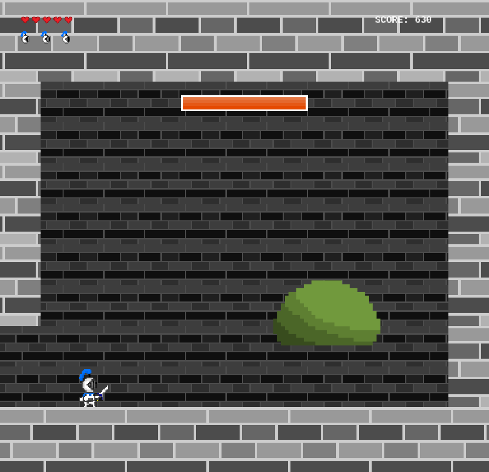
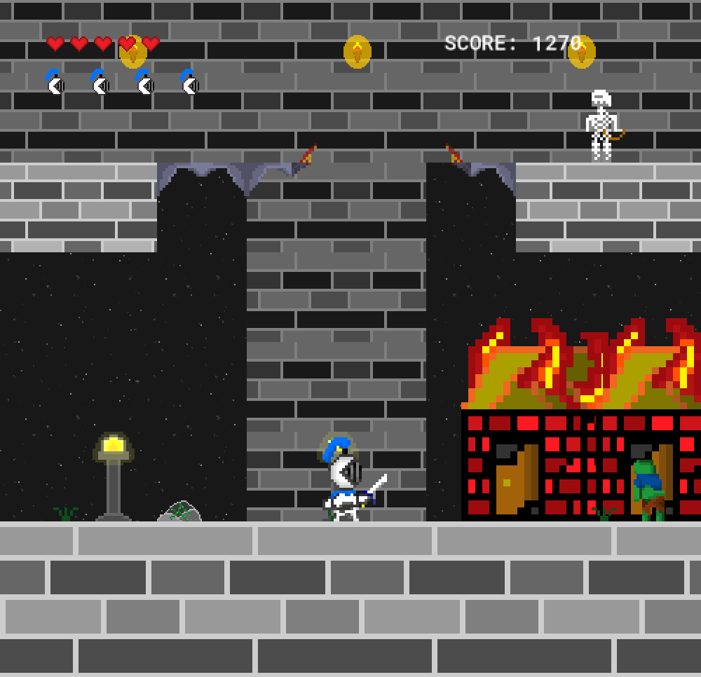
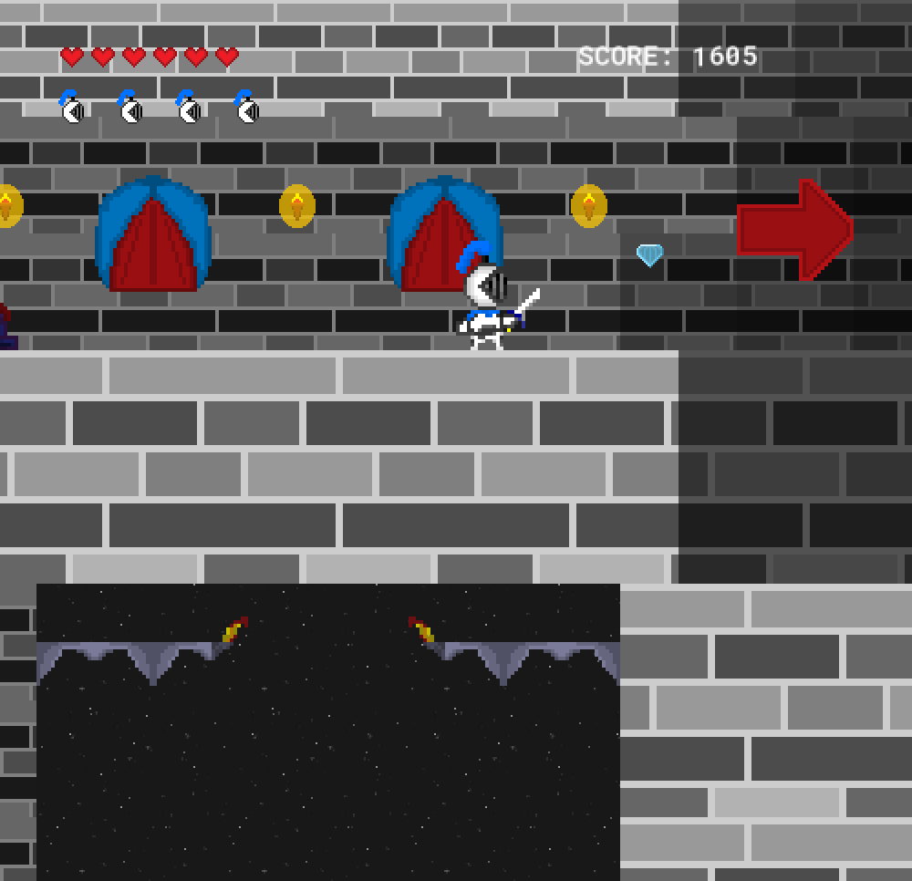

**Contents:**
<ul>
  <li><a href="#game-about">Game About 📜</a></li>
  <li><a href="#game-controls">Game Controls 🎮</a></li>
  <li><a href="#game-license">Game License 📄</a></li>
  <li><a href="#known-game-bugs">Known Game Bugs 🕷️</a></li>
  <li><a href="#game-content">Game Content ✨</a></li>
</ul>

 

<h2>Game About 📜</h2>
 

I made this game a long time ago in GameMaker for an FBLA competitive event and just recently found the executable for it. I do not have the GameMaker source files, as that was on a different computer that is now lost, so I can not upload that here. This game can not be found anywhere else on the internet. Apart from that, this game is about you being a knight where you have to save the kingdom from an evil curse in the land.

Also, I want to note that I do not have the sources for the music/sfx used in the game and I apologize for that. However, everything else in the game was created by me.
 
 

<h2>Game Controls 🎮</h2>
 

**Controls:**
* ← = move left
* ↑ = jump
* → = move right
* Space Key = sword attack
 

<h2>Game License 📄</h2>
 

The license says not to redistribute the game, reverse engineer it, and some other things; however, I do not mind if you do any of that to my game, but anything in GameMaker's intellectual property is theirs.
 
 

<h2>Known Game Bugs 🕷️</h2>
 

* After losing all of your lives, the game does not have a game over screen. You will have to restart the application.
* Collisions with floating platforms and attacking with the sword act weird.
* Full screening does not persist when you enter a different area.
 
 

<h2>Game Content ✨</h2>
 

 
 
